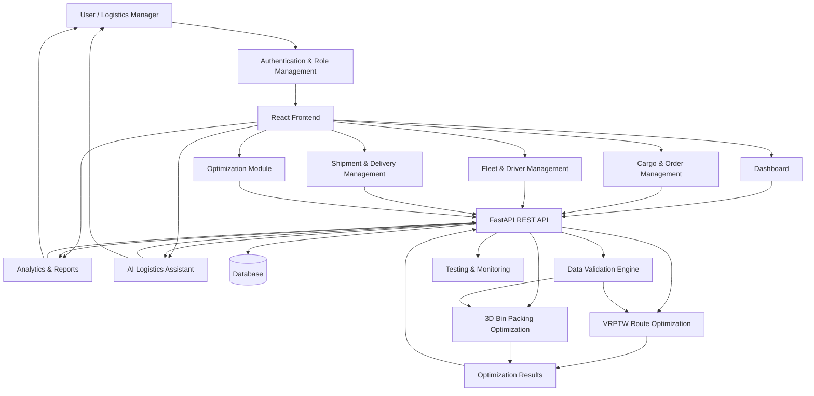

# CargoZara

## Full-Stack Logistics Management & Optimization Platform

CargoZara is a full-stack logistics management and optimization platform designed to streamline **cargo operations, fleet management, shipment planning, route optimization, and delivery management** through a unified web application.

The platform combines **cargo and order management, vehicle routing, 3D bin-packing, shipment validation, analytics, and AI-assisted logistics insights** to help logistics teams make faster, data-driven, and more efficient operational decisions.

---

## Key Features

### Logistics Management

* Role-based authentication and access control
* Cargo and order management
* Shipment creation and tracking
* Multi-vehicle and multi-driver management
* Delivery planning and management
* Cargo capacity and constraint management

### Optimization

* Vehicle Routing Problem with Time Windows (VRPTW)
* 3D cargo bin-packing optimization
* Vehicle capacity optimization
* Route and shipment planning
* Integrated cargo and routing analysis
* What-if optimization scenarios

### Data & Analytics

* Cargo and shipment data validation
* CSV/JSON import and export
* Logistics performance metrics
* Fleet utilization analysis
* Delivery and route analytics
* Optimization results visualization

### AI-Assisted Insights

* Logistics planning assistance
* Operational recommendations
* Route and cargo insights
* Scenario analysis
* Decision-support information

### Engineering & Testing

* RESTful backend APIs
* API testing
* Optimization algorithm testing
* Automated backend tests
* Technical documentation

---

# System Flow



### Platform Workflow

**User → Frontend → Backend API → Validation → Optimization → Results → Analytics / AI Insights**

1. Users authenticate through the application.
2. The React frontend provides access based on the user's role.
3. Cargo, vehicle, driver, shipment, and delivery data are submitted to the backend.
4. The validation engine checks data quality and operational constraints.
5. Valid data is processed by the optimization engines.
6. VRPTW generates optimized vehicle routes while considering delivery constraints and time windows.
7. The 3D bin-packing engine determines efficient cargo placement based on dimensions and vehicle/container capacity.
8. Optimization results are returned to the backend and displayed through dashboards and visualizations.
9. Analytics modules provide performance metrics and operational insights.
10. The AI-assisted module helps users interpret results and evaluate logistics scenarios.

---

# Optimization

CargoZara uses multiple optimization components to support practical logistics planning.

## VRPTW

The **Vehicle Routing Problem with Time Windows (VRPTW)** module optimizes vehicle routes while considering:

* Delivery locations
* Vehicle capacity
* Delivery time windows
* Route constraints
* Shipment requirements

The objective is to generate feasible and efficient delivery routes.

## 3D Bin Packing

The **3D Bin Packing** module optimizes the placement of cargo inside vehicles or containers using:

* Cargo length
* Cargo width
* Cargo height
* Cargo weight
* Available container dimensions
* Available capacity

The objective is to maximize usable space while maintaining feasible cargo placement.

## Integrated Optimization

CargoZara combines routing and cargo-planning concepts to provide a more practical logistics planning workflow.

```text
Cargo Data
     │
     ▼
Data Validation
     │
     ├───────────────┐
     ▼               ▼
3D Bin Packing    VRPTW Routing
     │               │
     └───────┬───────┘
             ▼
    Optimization Results
             │
             ▼
      Analytics & AI
             │
             ▼
       User Decisions
```

---

# Technology Stack

## Frontend

* React
* TypeScript
* Vite
* CSS

## Backend

* Python
* FastAPI
* REST APIs
* Pydantic

## Optimization

* VRPTW
* 3D Bin Packing
* Constraint Validation
* Performance Metrics

## Testing

* Pytest
* API Testing
* Optimization Testing

## Data

* CSV / JSON
* Structured logistics datasets
* Database integration

---

# Project Architecture

```text
CargoZara/
│
├── frontend/
│   ├── src/
│   ├── public/
│   ├── package.json
│   └── vite.config.ts
│
├── backend/
│   ├── app/
│   │   ├── api/
│   │   ├── ai/
│   │   ├── models/
│   │   ├── optimization/
│   │   └── schemas/
│   │
│   ├── optimization/
│   ├── tests/
│   ├── docs/
│   └── requirements.txt
│
├── docs/
├── README.md
├── LICENSE
├── .gitignore
├── package.json
└── start.bat
```

---

# Application Architecture

```text
                    ┌──────────────────────┐
                    │        Users         │
                    │ Admin / Operations   │
                    └──────────┬───────────┘
                               │
                               ▼
                    ┌──────────────────────┐
                    │   React Frontend     │
                    │ Dashboard & Modules  │
```
